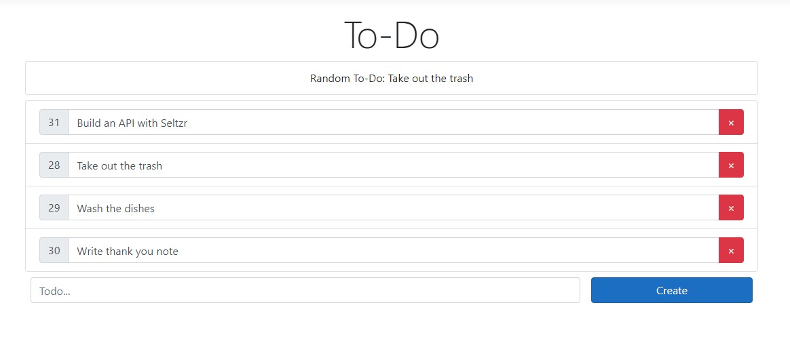

# Getting Started with Seltzr and Entity Framework Core

In this getting started example, we'll be building a simple to-do app. When you're finished, you'll be able to use a web interface to create, read, update, and delete from a to-do list:




## Terminology
* Definitions of the technical terms used in this article are listed below:
	* **API:** Every call to some form of `app.UseSeltzr` is an "API," a set of routes bundled together for working with a specific model.
	* **Model:** The data class that the API operates on. In Entity Framework, this is also referred to as an Entity.
	* **Route:** A bundle of everything that makes up a request with a single associated route pattern: parsers, filters, etc.
	* **Route Pattern:** The string pattern that determines whether an HTTP request path matches a route

## Prerequisites
* [Visual Studio with .NET Core](https://visualstudio.microsoft.com/) (Windows) or [Visual Studio Code](https://code.visualstudio.com/) and the [.NET Core SDK](https://www.microsoft.com/net/download/core) (Windows, Mac, Linux)
* A good knowledge of ASP.NET Core and Entity Framework is recommended, but not required.

## Creating a new Project
* Create a new ASP.NET Core project in Visual Studio, or on the command line.

### [Visual Studio 2019](#tab/vs)
* From the Start Page, click on **Create a new project**
* Click on or search for **ASP.NET Core Web Application**
* Enter a suitable project name, like **SeltzrGetStarted**
* Click **Create**
* When prompted, choose the **Web Application** template

### [Command Line](#tab/cli)
Create a new folder for your project, and a new web application with `dotnet`.
```bash
--- Header: Bash nocopy---
~$ mkdir SeltzrGetStarted && cd SeltzrGetStarted
~/SeltzrGetStarted$ dotnet new webapp
```
***

## Installing Dependencies
* Next, install the `Seltzr.EntityFrameworkCore` nuget package, as well as the Entity Framework package for Sqlite: `Microsoft.EntityFrameworkCore.Sqlite`.

### [Visual Studio 2019](#tab/vs)
* From the toolbar, select **Tools** > **NuGet Package Manager** > **Package Manager Console**
* Enter the following commands in the Package Manager Console:
```powershell
--- Header: Package Manager Console ---
Install-Package Microsoft.EntityFrameworkCore.Sqlite
Install-Package Seltzr.EntityFrameworkCore
```
### [Command Line](#tab/cli)
```bash
--- Header: Bash ---
dotnet add package Microsoft.EntityFrameworkCore.Sqlite
dotnet add package Seltzr.EntityFrameworkCore
```
***

* Once you've installed the packages, build the project (`Ctrl+Shift+B` or `dotnet build`) to make sure they installed properly.

## Creating the Web Interface
### HTML
* To create the web interface, start by replacing the code in **Pages/Index.cshtml** with the following:

[!code-cshtml[Index.cshtml](../../code/getting_started/todo/Index.cshtml?name=main)]

* This code:
	* Creates a container for todo items
	* Creates a text input and button for creating new todo items

### Javascript
* Next, replace the code in **wwwroot/js/site.js** with the following: 

[!code-js[site.js](../../code/getting_started/todo/site.js?name=main)]

* This code:
	* Sets up requests to create, read, update, and delete todo items
	* Sets up an event listener on todo items to update them
	* Adds a method for rendering todo items on the page
	* Sets up an event listener on the create button to create new todos

## Creating the `Todo` Model

* In the root directory of your project, create a file called **Todo.cs** and create the `Todo` model class, which defines a primary key `Id`, a value `Text`, and a creation date `Created`.

[!code-csharp[Todo.cs](../../code/getting_started/todo/Todo.cs)]

* Next, define the database context for our `Todo` items:

[!code-csharp[TodoContext.cs](../../code/getting_started/todo/TodoContext.cs)]

* Finally, create the `Todo` table in the database using EF Core tools:
### [Visual Studio 2019](#tab/vs)
In the Package Manager Console, run the following:
```powershell
--- Header: Package Manager Console ---
Install-Package Microsoft.EntityFrameworkCore.Tools
Add-Migration InitialCreate
Update-Database
```

For more details on what these commands are doing, refer to EF Core's [getting started guide](https://docs.microsoft.com/en-us/ef/core/get-started/?tabs=visual-studio#tabpanel_CeZOj-G++Q-4_visual-studio)
### [Command Line](#tab/cli)
```bash
--- Header: Bash ---
dotnet tool install --global dotnet-ef
dotnet add package Microsoft.EntityFrameworkCore.Design
dotnet ef migrations add InitialCreate
dotnet ef database update
```

For more details on what these commands are doing, refer to EF Core's [getting started guide](https://docs.microsoft.com/en-us/ef/core/get-started/?tabs=visual-studio#tabpanel_CeZOj-G++Q-4_visual-studio)
***
## Building the API
* If you try to run the project now, you'll get errors because the webpage can't connect to the API. Let's fix that.
* Register the database context in **Startup.cs** so that Seltzr can use it.

[!code-csharp[Startup.cs](../../code/getting_started/todo/Startup.cs?name=efcore&highlight=3)]

* Import Seltzr and initialize it at the end of `Configure` using the extension method [AddEFCoreSeltzr(String, Action\<SeltzrOptionsBuilder\>)](xref:Microsoft.Extensions.DependencyInjection.EFCoreSeltzrApplicationBuilderExtensions.AddEFCoreSeltzr``2(Microsoft.AspNetCore.Builder.IApplicationBuilder,System.String,System.Action{Seltzr.Options.Builder.SeltzrOptionsBuilder{``0,Seltzr.Auth.NoUser}}))

[!code-csharp[Startup.cs](../../code/getting_started/todo/Startup.cs#step0)]
[!code-csharp[Startup.cs](../../code/getting_started/todo/Startup.cs?name=step1&highlight=3)]

* The above code:
	* Creates a new API with a base route pattern of "todos/". All other routes created for this API will start with "todos/"
	* Defines a callback that takes in a [SeltzrOptionsBuilder](xref:Seltzr.Options.Builder.SeltzrOptionsBuilder`2) for setting options and creating child routes for this API.

#### Adding options
* Add some options to the API that affect all routes.
[!code-csharp[Startup.cs](../../code/getting_started/todo/Startup.cs?name=step2&highlight=2-5)]

* The above code:
	* Sets the API up to parse HTTP request bodies in the JSON format. **See Also:** <xref:parsing>
	* Sets the API up to return all responses in the JSON format. **See Also:** <xref:result-writers>
	* Adds an [**Exception Handler**](xref:exception-handlers) so that unhandled exceptions are caught and returned in the API response.

#### Declaring routes
* Declare four routes on the API for working with `Todo` items.
[!code-csharp[Startup.cs](../../code/getting_started/todo/Startup.cs?name=step3&highlight=6-9)]

* The above code:
	* Creates four new routes
	* The first, [Get()](xref:Seltzr.Extensions.SeltzrOrmOptionsBuilderExtensions.Get``2(Seltzr.Options.Builder.SeltzrOptionsBuilder{``0,``1})), defines a `GET` request that will return all of the `Todo` items in the database
	* [DeleteByPrimaryKey()](xref:Seltzr.Extensions.SeltzrOrmOptionsBuilderExtensions.DeleteByPrimaryKey``2(Seltzr.Options.Builder.SeltzrOptionsBuilder{``0,``1})) defines a `DELETE` request that will accept a value for `Id` at the end of the route pattern (e.g. `/todos/4`) and delete the matching `Todo`
	* [PatchUpdateByPrimaryKey()](xref:Seltzr.Extensions.SeltzrOrmOptionsBuilderExtensions.PatchUpdateByPrimaryKey``2(Seltzr.Options.Builder.SeltzrOptionsBuilder{``0,``1})) defines a `PATCH` request that similarly accepts a value for `Id` and updates the `Todo` using the values provided in the request body.
	* [PostCreate()](xref:Seltzr.Extensions.SeltzrOrmOptionsBuilderExtensions.PostCreate``2(Seltzr.Options.Builder.SeltzrOptionsBuilder{``0,``1},System.Action{Seltzr.Options.Builder.SeltzrOptionsBuilder{``0,``1}})) defines a `POST` request that accepts a JSON request body and creates a new `Todo`

> [!NOTE]
> Those four methods aren't the only ones that create routes. See <xref:routing> for a comprehensive list.

## Run the app
* With all four routes defined, run the app by hitting the play button in Visual Studio or executing `dotnet run` in a terminal.
* If a browser doesn't open automatically, open one and browse to the link output in the console.
* When the website loads, use the field at the bottom of the page to type in a new todo item and hit **Create**.
* A new todo item should be created and displayed alongside its `Id` above the text field. Try entering new text into the displayed item and hitting `Enter`. A blue flash indicates that the todo item has been updated. 
* Hitting the red `X` will delete the todo item.
* Hovering over the `Id` will display the creation date for the todo item. There's no logic to set that yet, however, so it will display a placeholder value.

> [!NOTE]
> Any any point when you're running the app, hit `Ctrl+Shift+I` (`Cmd+Shift+I` on MacOS) and click on the **Network** tab in the window that appears to observe the raw network requests and responses from the API.

## Extending the API
* Though the simple API works fine, these next steps cover some nice features you can add to polish it off.
#### Sorting the `Todo` Items
* Use the [OrderBy](xref:Seltzr.Options.Builder.SeltzrOptionsBuilder`2.OrderBy``1(System.Linq.Expressions.Expression{System.Func{`0,``0}})) method to sort the todo items alphabetically by their `Text` property:
[!code-csharp[Startup.cs](../../code/getting_started/todo/Startup.cs?name=step4&highlight=6)]

* Under the hood, this method adds a [**Filter**](xref:filtering) to the route. A filter is anything that modifies the dataset, even if it doesn't actually "filter" models out.
* Run the app and create a new todo item. It should be inserted alphabetically into the todo list.

#### Requiring Non-Empty Input
* Currently, when creating or updating a todo item, empty or whitespace-only text is accepted as a valid value for the item. Use the <xref:Seltzr.Options.Builder.SeltzrOptionsBuilder`2.RequireAllInput(System.Func{`0,System.Boolean})> method to prevent this.
[!code-csharp[Startup.cs](../../code/getting_started/todo/Startup.cs?name=step5&highlight=7)]

* This method creates a [**Condition**](xref:conditions) that requires the input text to not be null or whitespace.
* Run the app. 
	* Create an empty todo. An error should appear.
	* Updating an existing todo with whitespace. A red flash and no change should occur.

> [!WARNING]
> Try putting the call to `RequireAllInput` at the end of the chain, after `PostCreate`. You'll notice it's possible to create empty todo items again. **Why?** Calls to Seltzr's options builder only apply to all **future** routes (methods like `Get()` and `DeleteByPrimaryKey()` are what create routes), any previous routes don't have those options applied to them.

> [!TIP]
> Try adding [.ForEachInput(t => t.Text = t.Text.Trim())](xref:Seltzr.Options.Builder.SeltzrOptionsBuilder`2.ForEachInput(System.Action{`0})) to also trim any excess whitespace from the ends of the todo item.

#### Setting a creation date
* Every method that creates a route, like `Get()` and `PostCreate()` also accepts an options handler of its own which can be used to set up additional options that **only apply to that route**. Use it here to default the `Created` property on `Todo` to the current date and time.

[!code-csharp[Startup.cs](../../code/getting_started/todo/Startup.cs?name=step6&highlight=11-13)]

* The [Default](xref:Seltzr.Options.Builder.SeltzrOptionsBuilder`2.Default``1(System.Linq.Expressions.Expression{System.Func{`0,``0}},``0)) method customizes the body parser to set a value for a property if none is provided in the request body.
* Run the app and create a new todo item.
* Hovering over the ID for that todo should display the creation date.


> [!TIP]
> With `Created` initialized, try updating the [OrderBy](xref:Seltzr.Options.Builder.SeltzrOptionsBuilder`2.OrderBy``1(System.Linq.Expressions.Expression{System.Func{`0,``0}})) method to [OrderByDescending](xref:Seltzr.Options.Builder.SeltzrOptionsBuilder`2.OrderByDescending``1(System.Linq.Expressions.Expression{System.Func{`0,``0}})) and sorting by `Created` instead.

> [!NOTE]
> Even though the website doesn't, an HTTP `POST` request to `/todos` can still provide the `Created` property. To force `Created` to always be set to `DateTime.Now`, use `Default()` in conjunction with [Ignore](xref:Seltzr.Options.Builder.SeltzrOptionsBuilder`2.Ignore(System.Linq.Expressions.Expression{System.Func{`0,System.Object}})) to ignore the `Created` property on any request body.

#### Getting a random `Todo`
* Define a new route that uses [Filter](xref:Seltzr.Options.Builder.SeltzrOptionsBuilder`2.Filter(System.Func{System.Linq.IQueryable{`0},System.Linq.IQueryable{`0}})) to perform an advanced operation.
* To avoid colliding with the existing `GET` request, define this route on the `/todos/random` route pattern.

[!code-csharp[Startup.cs](../../code/getting_started/todo/Startup.cs?name=step7&highlight=9-11)]

> [!NOTE]
> Though a working example for this guide, it's probably not a good idea to declare a `new Random()` on every request in practice.

* To make use of this new route, update the website:
[!code-cshtml[Index.cshtml](../../code/getting_started/todo/Index.cshtml?name=random&highlight=4-6)]
[!code-js[site.js](../../code/getting_started/todo/site.js?name=random)]

* Run the app. A random todo item should appear at the top of the page.
* Additionally, try browsing to `/todos/random`. You should see a random todo item returned in a JSON array.

> [!NOTE]
> **Why does `/todos/random` return an array?** Seltzr won't make assumptions that a route will always return a single element, even if it is always true. In fact, a `GET` request to `/todos/random` will return an empty array if there are no todo items. To make this route behave more like a traditional API and always return a single element, use the <xref:Seltzr.Options.Builder.SeltzrOptionsBuilder`2.RequireExactlyOne> and <xref:Seltzr.Options.Builder.SeltzrOptionsBuilder`2.StripArrayIfSingleResult(System.Boolean)> methods alongside `Filter`.

## Summary
* In this guide, you learned how to:
	* Setup a basic REST API with Seltzr.
	* Create routes using the `Get`, `PostCreate`, `PatchUpdateByPrimaryKey`, and `DeleteByPrimaryKey` methods.
	* Use filters and conditions to extend the API.
	* Create route-specific options by providing a callback to a route-creating method.

## Further Reading
* <xref:request-flow>
* <xref:todo-ext-auth>
* <xref:todo-ext-pagination>